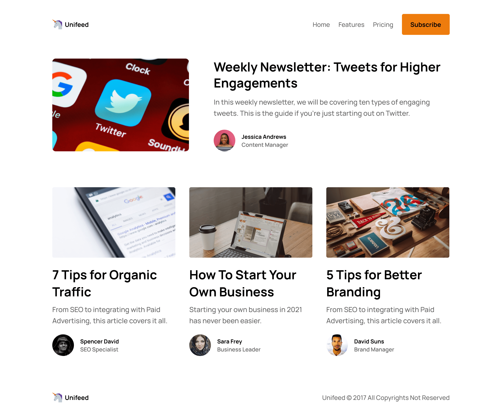

# UnifeedBlog Website

Welcome to the [UnifeedBlog](https://www.codewell.cc/challenges/unifeed-blog-page--608d9d5c747bad001532bd7c) project! This is a website where I'm learning web development by integrating designs provided by CodeWell. The goal is to create a visually appealing blog website.
## Screenshots

## Design Source

The design for this project was provided by [CodeWell](https://www.codewell.cc/). It's a great platform for practicing web development skills through real-world design implementations.

## Preview

You can see a live preview of the UnifeedBlog website [here](https://toukoms.github.io/unifeedblog).

## Technologies Used

- HTML5
- CSS3

## Features

- Responsive layout for various screen sizes
- Blog articles display

## How to Run

1. Clone this repository: `git clone https://github.com/toukoms/unifeedblog.git`
2. Navigate to the project folder: `cd unifeedblog`
3. Open the `index.html` file in your web browser.

## Feedback and Contact

I'm open to any feedback and suggestions for improving this project. Feel free to reach out to me through [email](mailto:tokiniaina090605@gmail.com).

Happy coding 😁!
